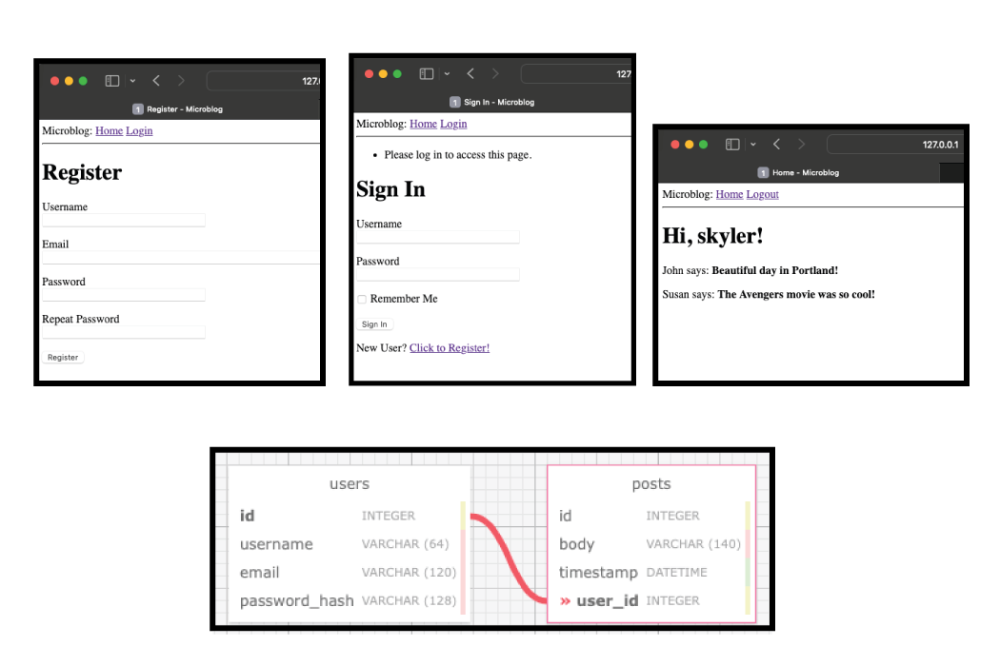

# microblog

  

## Setup

```
cd microblog
python3 -m venv venv
```
### macOS
```
source venv/bin/activate
```

### Windows

```
venv\Scripts\activate
```
### Windows Power Shell
```
venv\Scripts\Activate.ps1
```

### Requirements
```
pip3 install -r requirements.txt
```

### Extended Setup

to add enviroment variables across terminal and cmd sessions

```
pip3 install python-dotenv
FLASK_APP=microblog.py
```

### Create Database
Database file should be included.
creating the database after FLASK_APP is set 
```
flask db init
flask db migrate -m "users & posts"
flask db upgrade
```

  

## Run App

while enviroment is active and in microblog directory

```
flask run
```

  

## View

Open browser and navigate to

```
flask run --port 5001
http://127.0.0.1:5001
```

