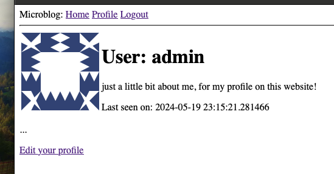

# microblog

  

## Profile Update
  

## Setup

```
cd microblog
python3 -m venv venv
```
### macOS
```
source venv/bin/activate
```

### Windows

```
venv\Scripts\activate
```
### Windows Power Shell
```
venv\Scripts\Activate.ps1
```

### Requirements
```
pip3 install -r requirements.txt
```

## View

Open browser and navigate to http://127.0.0.1:5001

```
flask run --port 5001
```

